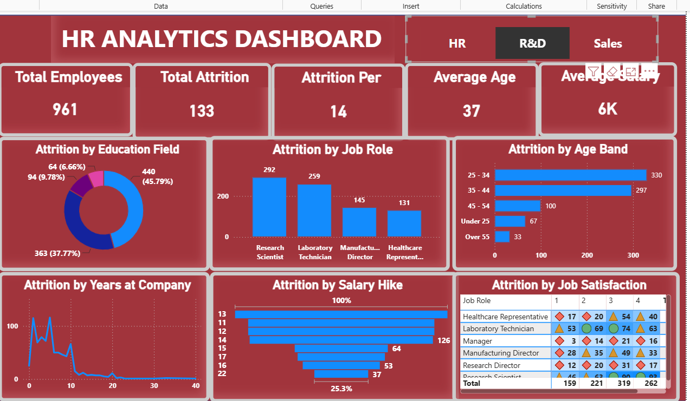

# HR Analytics Dashboard

An interactive HR Analytics Dashboard built using **Microsoft Power BI** to analyze employee attrition, demographics, job roles, salary trends, and job satisfaction.

## 📊 Project Overview

This project analyzes employee data and presents key HR metrics through an interactive Power BI dashboard.

The dashboard helps explore employee attrition patterns across different dimensions such as education, job role, age group, salary hike, years at the company, and job satisfaction.

## 🛠️ Tools & Technologies

- **Microsoft Power BI** – Dashboard development and data visualization
- **Microsoft Excel** – Dataset and data preparation
- **Power BI Visualizations** – Charts, cards, tables, filters, and interactive elements

## 📈 Dashboard Features

### Key Metrics

- Total Employees
- Total Attrition
- Attrition Rate
- Average Age
- Average Salary

### Visual Analysis

- Attrition by Education Field
- Attrition by Job Role
- Attrition by Age Band
- Attrition by Years at Company
- Attrition by Salary Hike
- Job Satisfaction Analysis
- Department-level analysis

## 🖼️ Dashboard Preview

## 📂 Files Included

- `HR_Analytics_Dashboard.pbix` – Power BI dashboard file
- `HR_Analytics_Dataset.xlsx` – Dataset used for analysis
- `hr-analytics-dashboard.png` – Dashboard preview image

## 🎯 Project Objective

The objective of this project is to analyze employee data and identify patterns in workforce attrition, demographics, job roles, compensation, and job satisfaction using interactive data visualizations.

## 💡 Skills Demonstrated

- Data Analysis
- Data Cleaning
- Data Visualization
- Power BI
- Microsoft Excel
- Dashboard Development
- KPI Reporting
- Interactive Reporting
- HR Analytics

## 👩‍💻 Author

**Bala Deekshitha Yadav**

B.Tech Graduate | Aspiring Data Analyst
